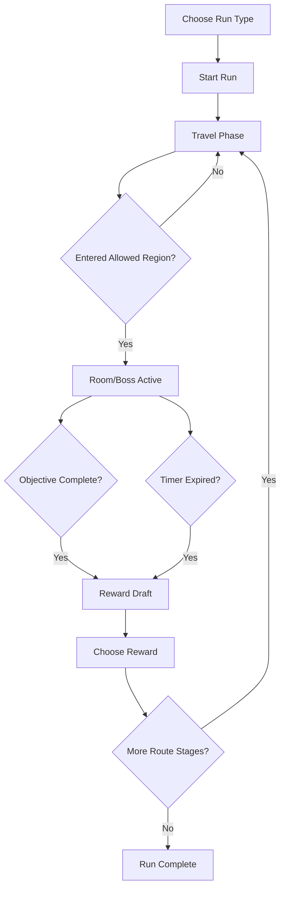
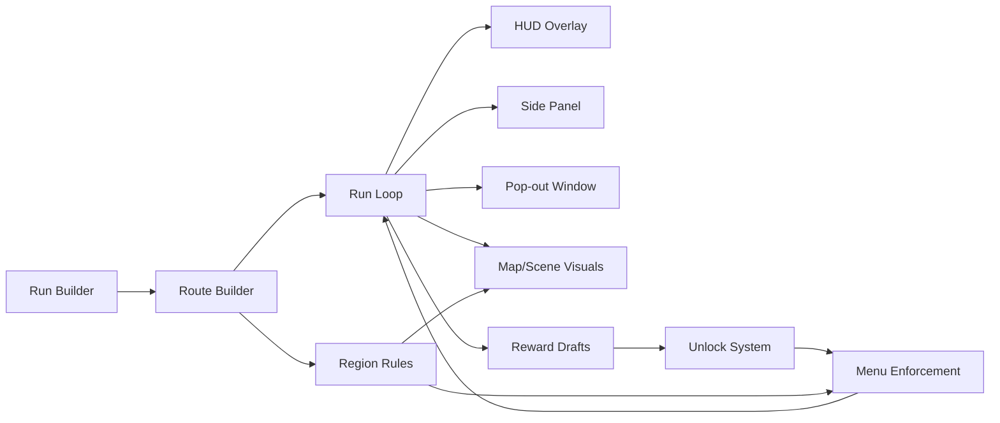

# RogueScape Plugin Presentation

## 1. What RogueScape Is

**RogueScape** is a RuneLite roguelike layer for Old School RuneScape.

Instead of playing freely across the whole world, the player starts a run, gets sent through a route of rooms and bosses, plays under restrictions, earns random rewards, unlocks new freedoms, and builds momentum across the run.

The core idea:

```text
OSRS world
  +
Roguelike run rules
  +
RuneLite visual guidance
  =
RogueScape
```

The plugin should feel like a magical OSRS challenge mode: familiar game mechanics, but structured into floors, rooms, rewards, relics, modifiers, and route progression.

---

## 2. The Player Fantasy

The player presses **Start Run** and the plugin says:

```text
You are now in a run.
Your next room is Draynor Village.
Go there.
The timer starts when you enter.
Only items/actions from that room count.
Clear the room or survive the timer.
Then choose a random reward.
Move deeper.
```

The player should not need to mentally track the system. The UI should carry the run.

---

## 3. Current Main Game Flow



Important behavior:

- Timer does not drain during travel.
- Timer starts when the player enters the allowed room region.
- The active room region is visually marked.
- Rewards are random, so the player knows the category but not the exact outcome.
- Bosses can appear as mixed route stages, not only at the end.

---

## 4. What The UI Is Responsible For

RogueScape needs the UI to answer four questions at all times:

```text
1. Where am I meant to be?
2. What am I allowed to do?
3. What is my current objective?
4. What reward/progress did I earn?
```

The UI is not just decoration. It is the rulebook, compass, run log, and reward screen.

---

## 5. Current UI Surfaces

```text
Side Panel
  - Run builder
  - Live run stats
  - Build/artifacts/modifiers/progression
  - Custom route/zone tools

Pop-out Window
  - Larger magical RuneScape-style interface
  - Run builder presentation
  - Live run view
  - Build/artifacts/rewards

HUD Overlay
  - Current room
  - Current objective
  - Timer / score
  - Region state

Reward Window
  - Card-based random reward choices
  - Relics, supplies, unlocks

Map/Scene Visuals
  - Green active room tiles
  - Grey outside-room dimming
  - World map green region highlight
  - World map jump marker
```

---

## 6. Visual Example: Travel Phase

```text
┌───────────────────────────────┐
│ RogueScape                    │
│ Floor 2 / 7                   │
│                               │
│ Phase: TRAVEL                 │
│ Destination: Draynor Village  │
│ Region: 12338                 │
│ Timer: 05:00 once you enter   │
│                               │
│ Objective waits there:        │
│ Collect 2 legal supplies      │
└───────────────────────────────┘
```

World/Map support:

```text
World Map:

        [grey map]
     ┌─────────────┐
     │ GREEN ROOM  │  <- allowed destination region
     └─────────────┘
          ◆          <- RogueScape marker, click to jump map
```

---

## 7. Visual Example: Room Active

```text
┌───────────────────────────────┐
│ RogueScape                    │
│ Phase: ROOM                   │
│ Room: Draynor Village         │
│ Timer: 04:12                  │
│                               │
│ Objective:                    │
│ Supplies 1 / 2                │
│                               │
│ Allowed:                      │
│ ✓ Pick up drops in room       │
│ ✓ Use resources found here    │
│                               │
│ Blocked:                      │
│ ✗ Bank                        │
│ ✗ Trade / GE                  │
│ ✗ Ground items outside room   │
│ ✗ Walk while outside room     │
└───────────────────────────────┘
```

Scene visual:

```text
Visible OSRS tiles:

green overlay  = current legal room
grey overlay   = outside active room
```

---

## 8. Visual Example: Reward Draft

```text
┌──────────────────────────────────────────────┐
│                 REWARD CHEST                 │
│              Choose one reward               │
│                                              │
│ ┌────────────┐ ┌────────────┐ ┌────────────┐ │
│ │  UNLOCK    │ │  SUPPLY    │ │  RELIC     │ │
│ │ Prayer     │ │ Sharks     │ │ Blood Relic│ │
│ │ Access     │ │ x5         │ │ +HP on kill│ │
│ └────────────┘ └────────────┘ └────────────┘ │
│                                              │
│ [Reroll]               [Skip]                │
└──────────────────────────────────────────────┘
```

The player sees the draft when:

- The room objective is completed.
- The room timer expires.
- A boss/stage completion triggers a reward stop.

---

## 9. Custom Run Builder

Custom mode is meant to be its own focused builder window so the normal run UI does not get cluttered.

The custom builder should let the player configure:

```text
Game Mode:
  - Scavenger
  - Reward

Loadout:
  - Naked
  - Low gear
  - Mid gear
  - Custom kit

Rooms:
  - Pick from room list
  - Choose allowance type:
    Supply / Armour / Weapons / Skilling / All / Shopping
  - Add to route container

Bosses:
  - Pick from boss list
  - Add into the same route container

Route:
  - Mixed rooms and bosses
  - Move up/down
  - Remove

Constraints:
  - Strictness
  - Bank unlock start
  - Time limit
  - Modifiers
  - Seed
```

---

## 10. Visual Example: Custom Builder Route

```text
┌───────────────────────────────┬──────────────────────────────┐
│ ROOM LIST                     │ ROUTE                        │
│                               │                              │
│ > Draynor Village             │ 1. Draynor Village [Supply]  │
│   Edgeville                   │ 2. Obor [Boss]               │
│   Varrock East                │ 3. Varrock East [Weapons]    │
│   Falador                     │ 4. Bryophyta [Boss]          │
│                               │                              │
│ Room Type: [Supply v]         │ [Up] [Down] [Remove]         │
│ [Add Room]                    │                              │
├───────────────────────────────┼──────────────────────────────┤
│ BOSS LIST                     │ MODIFIERS / CONSTRAINTS      │
│                               │                              │
│ > Obor                        │ Strictness: Balanced         │
│   Bryophyta                   │ Time: 5 min rooms            │
│   Barrows                     │ Seed: iron-chaos-22          │
│                               │                              │
│ [Add Boss]                    │ [Start Custom Run]           │
└───────────────────────────────┴──────────────────────────────┘
```

---

## 11. Run Systems Working Together



The important connection:

```text
Route stage
  -> region rule
  -> travel target
  -> map highlight
  -> room timer starts on entry
  -> enforcement arms
  -> objective/reward flow
```

---

## 12. Unlock System

Unlocks turn room clears into meaningful run progression.

Examples:

```text
Supply room clear
  -> may unlock potions or food rules

Shop room clear
  -> may unlock trade/shop access

Combat room clear
  -> may unlock prayer/special attack/combat freedom

Reward draft
  -> may grant relics, supplies, or extra permissions
```

Unlocks affect enforcement:

```text
Prayer locked     -> prayer menu blocked
Prayer unlocked   -> prayer menu allowed

Potions locked    -> drink potion blocked
Potions unlocked  -> potion use allowed

Bank locked       -> bank blocked
Bank unlocked     -> bank allowed
```

---

## 13. Map Guidance System

The plugin currently uses several layers of guidance:

```text
HUD:
  "Travel to the allowed room region"

World scene:
  Green tiles = legal room
  Grey tiles = outside room

World map:
  Green region = destination room
  RogueScape marker = target point
  Click marker = jump world map to target

Shortest Path bridge:
  Attempts to set Shortest Path target if plugin is installed/enabled
```

This means the player can understand the destination even if Shortest Path integration is not cooperating.

---

## 14. Current Testing Story

Things testers should verify:

```text
Start Run:
  - Press start from side panel
  - Press start from pop-out window
  - Press Start Custom Run

Travel:
  - HUD shows destination
  - World map marker appears
  - Green destination region appears on map
  - Timer does not drain before entering

Room Active:
  - Timer starts on entry
  - Green tiles show legal room
  - Outside room is dimmed
  - Enforcement blocks outside-room pickups

Rewards:
  - Complete room -> reward appears
  - Timer expires -> reward appears
  - Reward choice applies relic/unlock/supply

Next Stage:
  - Next stage returns to Travel
  - New marker/region appears
```

---

## 15. What Still Needs Iteration

The plugin is now moving toward a playable skeleton, but these are the areas likely to need live testing and tuning:

```text
Shortest Path:
  - Confirm external plugin bridge works in live RuneLite
  - If not, keep map marker as primary guidance

Walk Blocking:
  - Current behavior is intentionally blunt
  - Needs live testing around edge cases

Region Data:
  - Some rooms may need better/more region IDs
  - Some destinations may need exact tile targets instead of region centers

Visual Polish:
  - More magical reward animations
  - Cleaner run state icons
  - Stronger artifact/modifier presentation

Balance:
  - Reward tables
  - Unlock pacing
  - Timer lengths
  - Boss placement
```

---

## 16. One-Sentence Pitch

**RogueScape turns OSRS into a guided roguelike run: travel room-to-room, survive restrictions, earn random rewards, unlock new freedoms, and build a unique run using RuneLite overlays, map guidance, and custom UI windows.**

